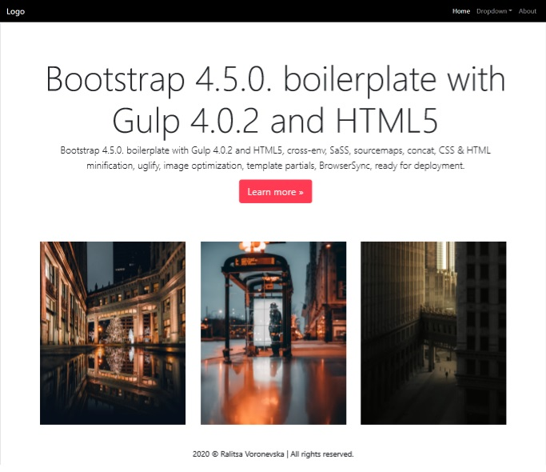

# Bootstrap 4.5.0. boilerplate with Gulp 4.0.2 and HTML5

Bootstrap 4.5.0. boilerplate with Gulp 4.0.2 and HTML5 for automation and rapid development:

* Bootstrap 4.5.0
* Gulp 4.0.2
* HTML5
* Sass
* sourcemaps
* concatenation
* CSS minification
* HTML minitification
* uglify
* image optimization
* template partials
* BroswserSync, live reload

[Documentation](https://bootstrapstarter.com/bootstrap-templates/template-basic-bootstrap-html/)

## How to
Download or clone the repository (git clone https://github.com/ralitsavoronevska/bootstrap-4-with-gulp-4-boilerplate.git). After that, from the root of your download/clone:

### Install

> $ npm install

If something goes wrong, delete the node_modules folder and run npm install again.

Now let’s make sure you also have Gulp installed globally:

> $ npm install gulp -g

### Start server

> $ gulp serve

You should see a live browser at http://localhost:3000/.

### Development

#### Override Bootstrap’s variables and create your custom styles

> src/scss/style.scss

This will be automatically compiled to src/css/styles.css.

#### Add custom scripts

> src/js/index.js

#### Partials

You can add partials in src/partials/.

Insert partial : <partial src="header.html"></partial>.

Examples are already added in this this project for header & footer.

### Production

> $ gulp

If you want HTML, CSS minification & image optimization:

> $ npm run prod

Docs folder is the destination. You can now go docs/index.html and check the output.

If you want you can deploy everything to your GitHub using gh-pages and a custom script (both already included in package.json):

> $ npm run deploy